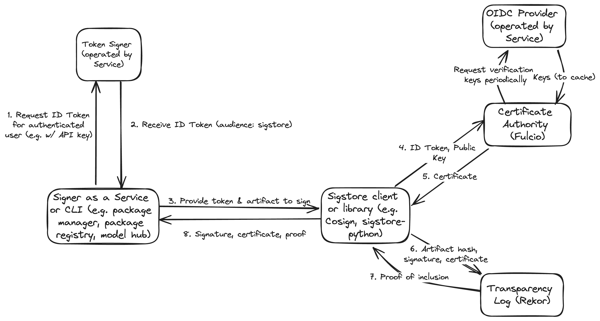

# Deploying an Identity Provider for Fulcio Integration

This document details how a client or service that wants to integrate with Fulcio can stand up a minimally viable identity provider to offer non-interactive signing,
where the client or service exchanges a user's identity token for a Fulcio certificate.

Identity providers should follow the security requirements outlined in [New IDP Requirements](new-idp-requirements.md) as well.

## Background & Motivation

Sigstore leverages identity-based signing by default, in which OpenID Connect (OIDC) identities are bound to ephemeral signing keys by Fulcio, Sigstore's certificate authority. As defined in [Spec: Fulcio](https://docs.google.com/document/d/1W5xp3g8\_jaqzDQmIvepNYsWb-bQNc0U2ZQgQ700Kjok/edit\#heading=h.la9r2zdnmmtx) and [documentation](https://github.com/sigstore/fulcio/blob/main/docs/oidc.md\#supported-oidc-token-issuers), Fulcio accepts signed OIDC identity tokens as part of the certificate signing request, verifies the token's signature, and extracts the identity from the token based on configuration. The most common examples of identity tokens include tokens with an `email` claim when signing is initiated by a developer or service account or tokens from CI providers such as GitHub Actions that include claims about the repository and CI workflow.

From Fulcio's requirements, there are a few requirements for identity tokens:

* The token includes the required claims as per the [OIDC Core specification](https://openid.net/specs/openid-connect-core-1\_0-errata2.html\#IDToken)  
* The provider configuration is available at a well-known endpoint as per the [OIDC Discovery specification](https://openid.net/specs/openid-connect-discovery-1\_0.html\#ProviderConfig) and the configuration has the required fields per the [specification](https://openid.net/specs/openid-connect-discovery-1\_0.html\#ProviderMetadata), even if the values are not used  
* The keys to verify the token are accessible at a URI defined in the provider configuration field `jwks_uri`

Note that Fulcio **does not** require that the identity provider implement the OIDC protocol to exchange credentials for a token. There are requirements that certain values in the configuration are populated, such as `token_endpoint`, to satisfy the underlying OIDC verification library Fulcio uses, but Fulcio will not use these values during verification. It only requires the above, that a) a valid signed token is presented, b) a configuration is available on a well-known endpoint, and c) the keys to verify the token are accessible from this configuration.

If a service wants to implement an integration with Sigstore, typically a client would need to have its user go through an OIDC authentication workflow for their provider of choice (Note that Fulcio has a set of allowlisted providers, but that can be easily extended with additional [identity provider onboarding](https://github.com/sigstore/fulcio/blob/main/docs/new-idp-requirements.md)), receiving an identity token for Sigstore and then sending that token to Fulcio as part of the certificate signing request. This interactive workflow requires a user to explicitly authenticate, so another integration option is for automated signing where the identity is for a workload identity such as a service account or CI provider identity. Both of these signing workflows are supported by Sigstore clients like Cosign or sigstore-python, with an option to pass an identity token obtained out of band.

If a service wants to minimize user authentication to reduce friction while signing and has a way to represent a unique user identity, the service could implement a minimally viable OIDC identity provider. The provider would not look like a typical provider that exchanges credentials for a token. The provider could simply generate an identity token for a user that is already authenticated and provide this token to Fulcio (which has allowlisted the provider) or a Sigstore client during artifact signing. The provider would only need to expose the well-known endpoint and verification keys to the internet if the service is signing on behalf of the user. If the user is performing signing in a client rather than through a service, then the token signer would need to be exposed to the user as an authenticated endpoint that exchanges a credential for an identity token.



## Implementation

The service provider needs to implement:

1) A token signer that issues an OIDC compliant ID token for a given identity  
1) An OIDC provider that conforms to the Discovery specification

A basic example can be found at [https://go.dev/play/p/L2y4Hnvrsek](https://go.dev/play/p/L2y4Hnvrsek), which includes initialization of a token signer, signing a token, initializing OIDC configuration and keys endpoints, verifying and parsing a token, and querying the configuration and keys. An example token for an email identity would be:

```
{
  "aud": "sigstore",
  "email": "test@foo.bar",
  "email_verified": true,
  "exp": 1257895800,
  "iat": 1257894000,
  "iss": "http://127.0.0.1:36435",
  "sub": "subject"
}

```

### Identity

Fulcio has support for many different token identities, though the most common would be [email](https://github.com/sigstore/fulcio/blob/main/docs/oidc.md\#email) and [CI workflow](https://github.com/sigstore/fulcio/blob/main/docs/oid-info.md\#requirements-to-support-signing-with-cicd-workload-identities). Reach out to Fulcio maintainers for more information if you have any questions or additional requirements.

We would expect identities for this type of minimal deployment to be represented as an email. For example, if users authenticate to the service with a username, the email address could be `username@service.com`. If this would conflict with existing email addresses, a service could choose another representation like `username@signing.service.com`. In the case of emails in tokens, Fulcio only verifies that the identity string matches an email address regular expression, not that the email is addressable.

#### Customizing Email Addresses

Users, particularly organizations, may not want an identity that includes the service name. Since the identity is needed to verify an artifact, it may look like the service signed the artifact on behalf of the user.

A service could provide a mechanism for an organization to register a domain for a set of artifacts so that the identity would include that domain, `username@registereddomain.com`. The service would require proof of ownership of a domain for an organization, which could be implemented following the ACME protocol with either an [HTTP](https://datatracker.ietf.org/doc/html/rfc8555\#section-8.3) or [DNS](https://datatracker.ietf.org/doc/html/rfc8555\#section-8.4) challenge that proves active possession of a domain by placing a challenge string on a well-known endpoint or DNS record.

### Cloud Deployment

This can be deployed as two microservices with very little configuration. Using Google Cloud Platform (GCP) as an example, you will need a KMS key for signing tokens. Cloud Functions or Cloud Run can be invoked to call KMS to sign a token for a given identity. For the OIDC configuration, it can be served statically through Cloud Storage.

## Integration & Testing

The provider will need to be added to Fulcio, following the [integration guide](https://github.com/sigstore/fulcio/blob/main/docs/oidc.md\#integration-guide) and [requirements](https://github.com/sigstore/fulcio/blob/main/docs/new-idp-requirements.md). A local instance of Fulcio can be spun up following the documentation in the repo in order to test the integration. Roughly, this involves:

1) Deploying a local instance of the identity provider  
1) Modifying the [configuration file](https://github.com/sigstore/fulcio/blob/main/config/config.jsn) to include an entry for the identity provider. You'll need to configure the `IssuerURL` to match the provider URL. The type will likely be `email`.  
1) Launching a local instance of Fulcio, e.g `docker-compose up`  
1) Sending a certificate signing request to Fulcio to issue a certificate. The easiest way would be to use [Cosign](https://github.com/sigstore/cosign) or [sigstore-python's](https://github.com/sigstore/sigstore-python) CLI, e.g. `cosign sign-blob README.md --bundle cosign.bundle --identity-token <token> --fulcio-url <local instance URL> --tlog-upload=false`. You can also construct the request following the [proto spec](https://github.com/sigstore/fulcio/blob/main/fulcio.proto). With Cosign, you can inspect the bundle output and verify the certificate content, e.g. `cat cosign.bundle | jq -r .cert | base64 -d | openssl x509 -text -noout`. Verify that `X509v3 Subject Alternative Name` matches the identity and `1.3.6.1.4.1.57264.1.1` matches the identity provider URL.

After adding the provider, Sigstore maintainers will deploy the updated configuration to the staging environment, which can be tested against following [this guide](https://docs.sigstore.dev/system\_config/public\_deployment/\#staging-instance). After you've verified the issued certificate matches what is expected, the configuration will be deployed to the production environment.
