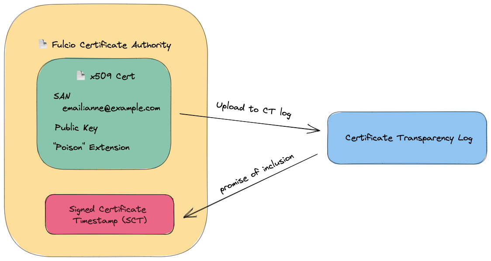

# Certificate Issuing Overview

This document walks through the process of issuing a code signing certificate. This is a great entry point to understanding how Fulcio
works if you're interested in contributing to the project or want to
learn more about what's happening under the hood.

## 1 | Certificate Request Input

To begin, the client submits a certificate request to Fulcio.

The certificate request contains the following:

- An OpenID Connect (OIDC) identity token. This is a signed JWT containing information about the
  principal (identity of the client), the issuer (who issued the identity token -
  Google, Microsoft, GitHub, etc.) and additional metadata such as expiration. The principal identity
  can either be a maintainer identity in the form of an email, or a workload identity.
- The public key. This is the public portion of a cryptographic key pair generated
  by the client. The public key will be embedded in the issued X.509 certificate.
- A signed challenge. This challenge proves the client is in possession of the private
  key that corresponds to the public key provided. The challenge is created by
  signing the subject (`sub`) of the OIDC identity token.
- Alternatively, instead of a public key and signed challenge, a client can provide a certificate
  signing request (CSR), which also provides a proof of possession and the public key.

See the [service definition](https://github.com/sigstore/fulcio/blob/main/fulcio.proto) for more details.

## 2 | Authentication

The first step in processing the certificate request is to authenticate the
OIDC ID token.

To authenticate the token Fulcio must:

- Use the issuer claim from the token to find the issuer's OIDC discovery
  endpoint
- Download the issuer's signing keys from the discovery endpoint
- Verify the ID token signature

## 3 | Verifying the challenge

Once the client has been authenticated, the next step is to verify the client
is in possession of the private key of the public key they’ve submitted. To do
this, Fulcio verifies the signed challenge or CSR. For a signed challenge, this is
a signature of the `sub` claim. The challenge and CSR are verified using the provided public key.

## 4 | Constructing a certificate

The client is now authenticated and has proved possession of the private key. Fulcio now
issues a code signing certificate for the identity from the ID token.

At a high level, this consists of:

- Embedding the provided public key in the certificate
- Setting the certificate's subject alternative name (who the certificate is issued for) to
  match the subject from the OIDC ID token. This could be an email, SPIFFE ID, or GitHub Actions workflow identity.
- Including the OIDC ID token issuer in a custom field in the certificate
- Setting various X.509 extensions depending on the metadata in
  the OIDC ID token claims (e.g GitHub Actions workflow information)

## 5 | Signing the certificate

The code signing certificate is now populated, but needs to be signed
by the certificate authority. This will form a chain of trust from the issued
certificate to the certificate authority root certificate.

Fulcio supports several signing backends to sign certificates:

- KMS: A KMS key hosted on GCP, AWS, Azure or Hashicorp
- [Tink](https://github.com/google/tink): A secure KMS-encrypted Tink keyset created with [tinkey](https://github.com/google/tink/blob/master/docs/TINKEY.md)
- PKCS#11: This works with any PKCS#11 devices including AWS CloudHSM,
  [softHSM](https://www.opendnssec.org/softhsm/) and others
- [Google CA Service](https://cloud.google.com/certificate-authority-service/docs): A GCP-hosted certificate authority
- Files: An on-disk password-protected private key
- Ephemeral (for testing): An in-memory key pair generated on start up 

See [Setting up a Fulcio instance](setup.md) for more details.

## 6 | Certificate Transparency log inclusion

As part of certificate issuance, the certificate will be appended to an immutable, append-only,
cryptographically verifiable certificate transparency (CT) log, which allows for issuance to be
publicly auditable.

A special X.509 extension, called a poison extension, is included in the certificate before it
is appended to the log. This certificate is called a precertificate, and is not yet usuable by clients.

The certificate transparency log returns a _Signed Certificate Timestamp_
(SCT). The SCT is a promise of inclusion in the log, signed by the CT log. It can be
verified without accessing the log, though a client can also request a cryptographic proof
of inclusion directly from the log.

The SCT is embedded within the certificate, and signed again.

Note that the Certificate Transparency (CT) log is separate from the [Rekor](https://github.com/sigstore/rekor)
transparency log. Fulcio's CT Log only stores issued certificates, while Rekor stores artifact signatures and attestations.

See [Certificate Transparency Log Information](ctlog.md) for more details.

## 7 | Return certificate to client

